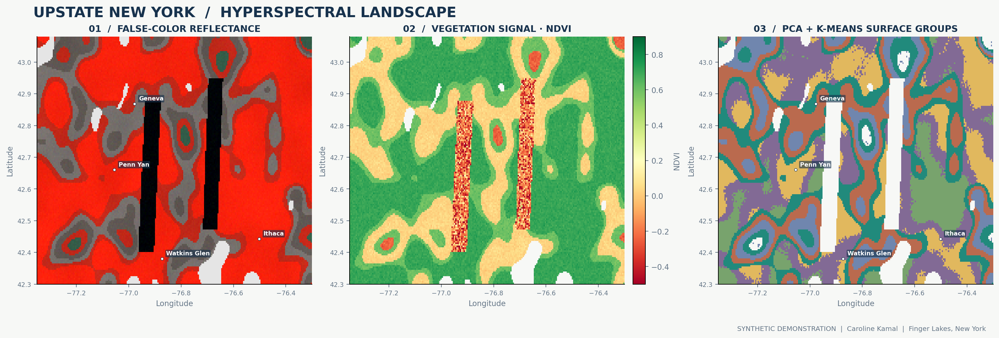
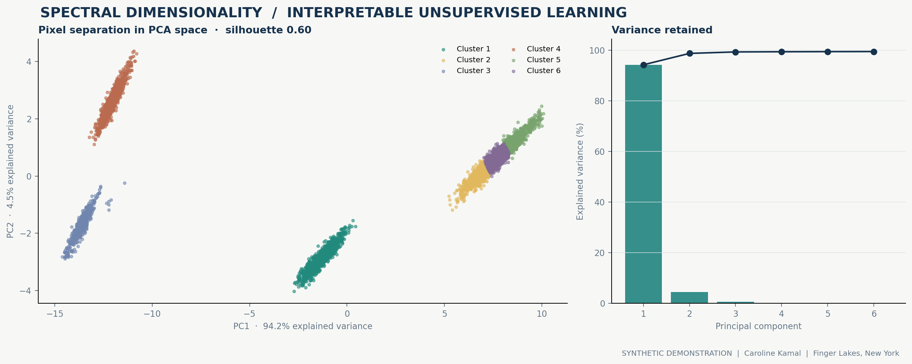
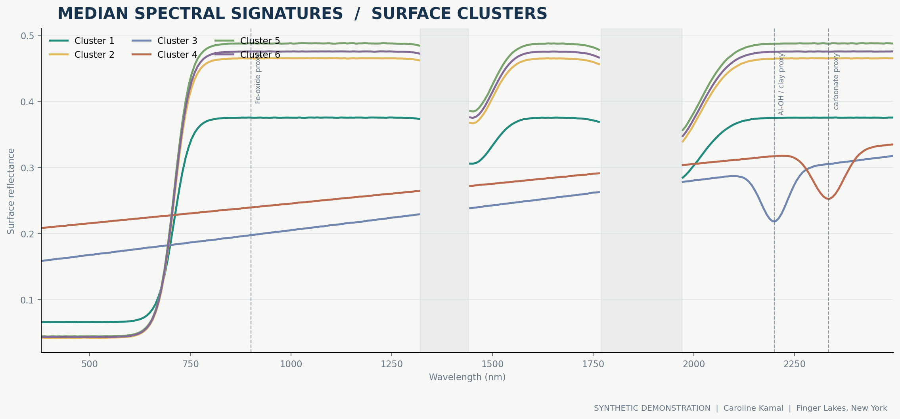
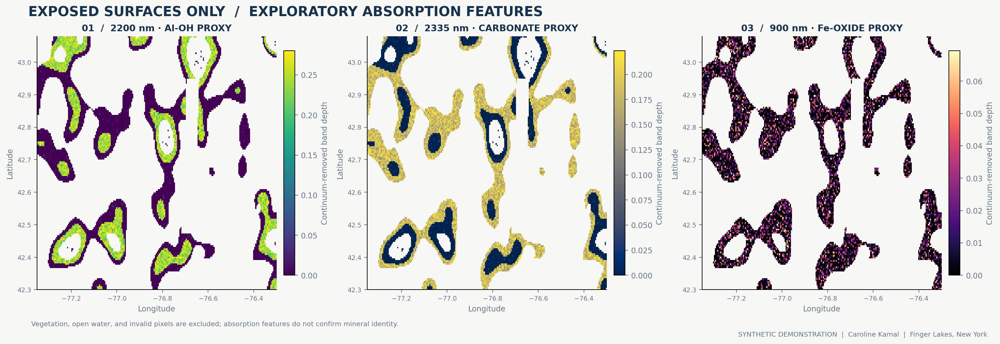
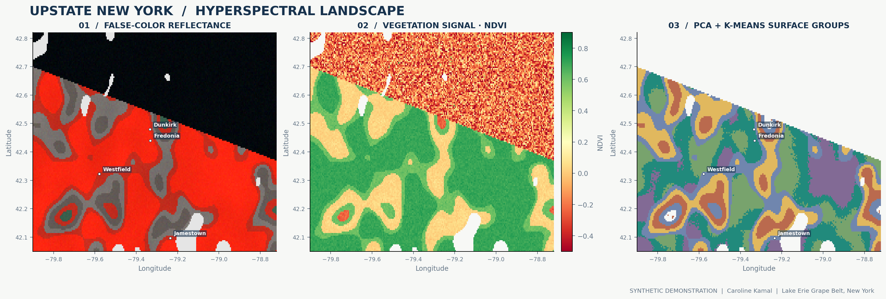

# Upstate New York Hyperspectral Surface Mapping

### Interpretable machine learning across the Finger Lakes and Lake Erie grape belt

[](.github/workflows/ci.yml)
[](pyproject.toml)
[](https://www.earthdata.nasa.gov/data/catalog/lpcloud-emitl2arfl-001)
[](LICENSE)

**Caroline Kamal** · Materials science, physics, and scientific computing  
[Portfolio](https://carolinekamal.github.io) · [GitHub](https://github.com/carolinekamal)



> **Data transparency:** The figures bundled with this repository are generated from a clearly labeled **synthetic demonstration scene**. They are not NASA observations, field measurements, verified mineral identifications, or real crop-health maps. The repository separately implements discovery, download, orthorectification, and analysis of real NASA EMIT scenes when regional coverage exists.

## Research question

How can imaging spectroscopy and interpretable machine learning separate vegetation, water, and exposed surface materials across upstate New York's agricultural landscapes?

This project focuses on the **Finger Lakes**, the **Seneca–Cayuga wine corridor**, and the **Lake Erie grape belt**. It combines domain-aware spectral preprocessing with principal component analysis and k-means clustering. Where surface soils are actually exposed, it also calculates exploratory absorption proxies associated with clay-related Al–OH features, carbonate-bearing materials, and ferric oxides.

The work grows out of my experience with hyperspectral datasets, Python, PCA, clustering, orthorectification, and vineyard research at Cornell AgriTech's Gold Lab, alongside my graduate work in materials science, crystallography, and physics.

## What the pipeline does

1. Searches NASA's actual **EMIT L2A surface reflectance** collection for a user-selected upstate New York bounding box.
2. Orthorectifies available NetCDF granules using their geometry lookup tables.
3. Excludes invalid observations and atmospheric water-absorption intervals.
4. Calculates vegetation and water indices, then masks pixels that are unsuitable for exposed-surface interpretation.
5. Applies standardized **PCA** and **k-means clustering** to valid land spectra.
6. Estimates continuum-removed absorption depths near **900 nm**, **2200 nm**, and **2335 nm**.
7. Produces reproducible figures, summary metrics, and exportable cluster spectra.

### At a glance

| Component | Implementation |
| --- | --- |
| Sensor target | NASA EMIT Level 2A surface reflectance |
| Spectral range | 381–2493 nm across 285 spectral bands |
| Study areas | Finger Lakes, Seneca–Cayuga corridor, Lake Erie grape belt |
| Processing | Quality masking, GLT orthorectification, atmospheric-band filtering |
| Machine learning | Standardized PCA, k-means, silhouette analysis |
| Surface interpretation | NDVI, NDWI, continuum-removed absorption proxies |
| Deliverables | Figures, JSON metrics, CSV spectra, optional GeoTIFF export |

## Results gallery

### Principal components and unsupervised surface groups



The first principal components separate broad spectral behavior across the modeled landscape. Cluster membership is exploratory: a visually distinct cluster does not establish a mineral species, crop variety, or disease state.

### Cluster spectral signatures



Shaded intervals indicate atmospheric absorption windows that are excluded from the analysis. Vertical guides mark potential ferric-oxide, Al–OH/clay, and carbonate-related features. On real imagery, these relationships require appropriate reference spectra and independent validation.

### Exposed-surface absorption proxies



Water, dense vegetation, and low-quality pixels are deliberately removed before plotting these indices. The maps show **spectral proxies**, not confirmed mineral abundance.

## Quick start

```bash
git clone https://github.com/carolinekamal/upstate-ny-hyperspectral-mapping.git
cd upstate-ny-hyperspectral-mapping

python -m venv .venv
source .venv/bin/activate
python -m pip install -e .

python -m upstate_hyperspectral demo \
  --region finger-lakes \
  --output-dir outputs/finger-lakes
```

The synthetic demonstration runs without NASA credentials and produces:

```text
outputs/finger-lakes/
├── analysis-summary.json
├── cluster-spectral-signatures.csv
└── figures/
    ├── pca-clusters.png
    ├── spectral-signatures.png
    ├── study-area-overview.png
    └── surface-proxies.png
```

Alternative study regions:

```bash
python -m upstate_hyperspectral demo --region seneca-cayuga --output-dir outputs/seneca-cayuga
python -m upstate_hyperspectral demo --region lake-erie --output-dir outputs/lake-erie
```

## Search for real NASA observations

Install the optional Earthdata and geospatial dependencies:

```bash
python -m pip install -e '.[nasa]'

python -m upstate_hyperspectral search \
  --region finger-lakes \
  --start 2023-05-01 \
  --end 2026-10-31 \
  --save outputs/finger-lakes-scene-inventory.json
```

Download any discovered granules:

```bash
python -m upstate_hyperspectral search \
  --region finger-lakes \
  --start 2023-05-01 \
  --end 2026-10-31 \
  --download \
  --download-dir data/raw
```

NASA downloads require a free [Earthdata Login](https://urs.earthdata.nasa.gov/). Search results may legitimately be empty because EMIT primarily targets arid dust-source regions, not the northeastern United States. Latitude compatibility does not imply scene coverage.

Analyze a downloaded scene:

```bash
python -m upstate_hyperspectral process \
  --input data/raw/EMIT_L2A_RFL_001_EXAMPLE.nc \
  --mask data/raw/EMIT_L2A_MASK_001_EXAMPLE.nc \
  --region finger-lakes \
  --output-dir outputs/observed-finger-lakes
```

The filenames above are placeholders; replace them with actual downloaded filenames. Verify quality-flag meanings in the corresponding product metadata before choosing `--mask-flags`.

## Geographic study areas

| Region | Bounding box: west, south, east, north | Context |
| --- | --- | --- |
| `finger-lakes` | `-77.35, 42.30, -76.30, 43.08` | Geneva, Ithaca, Watkins Glen, Seneca/Cayuga corridors |
| `seneca-cayuga` | `-77.12, 42.38, -76.45, 42.94` | Focused wine-region and Cornell AgriTech study area |
| `lake-erie` | `-79.90, 42.05, -78.72, 42.82` | Chautauqua County and the western New York grape belt |

All boxes are WGS84 longitude/latitude. GeoJSON versions are provided in [`data/regions/upstate_ny_regions.geojson`](data/regions/upstate_ny_regions.geojson).



*Lake Erie extension, also generated from explicitly synthetic demonstration data.*

## Scientific limitations

- **Coverage:** EMIT's mission emphasizes arid dust-source regions. Upstate New York availability must be checked, not assumed.
- **Vegetation:** A canopy spectrum does not reveal the mineralogy hidden beneath it. Mineral-related proxies are restricted to exposed surfaces.
- **Spatial resolution:** EMIT's nominal 60 m pixels may mix vines, vegetation, roads, soil, and open water.
- **Unsupervised learning:** PCA and k-means discover spectral patterns, not independently validated land-cover or mineral labels.
- **Absorption proxies:** Features near 900, 2200, and 2335 nm are not unique mineral identifications.
- **Water and atmosphere:** Cloud, atmospheric absorption, surface moisture, illumination, and mixed pixels can alter interpretation.
- **Synthetic demonstration:** Packaged figures demonstrate the software, not scientific findings about New York.
- **Independent validation:** Real interpretation requires field observations, reference spectra, or appropriately validated EMIT products.
- **Authorized data only:** Cornell, NASA, and collaborator data should not be uploaded unless sharing is explicitly permitted.

See [`docs/methodology.md`](docs/methodology.md) for details, [`docs/data-access.md`](docs/data-access.md) for NASA access instructions, and [`docs/publishing-and-portfolio.md`](docs/publishing-and-portfolio.md) for GitHub publishing and portfolio copy.

## Repository structure

```text
upstate-ny-hyperspectral-mapping/
├── .github/workflows/ci.yml
├── data/regions/upstate_ny_regions.geojson
├── docs/
│   ├── data-access.md
│   ├── methodology.md
│   └── publishing-and-portfolio.md
├── examples/demo-analysis-summary.json
├── figures/
├── notebooks/01_finger_lakes_workflow.ipynb
├── src/upstate_hyperspectral/
│   ├── analysis.py
│   ├── cli.py
│   ├── nasa.py
│   ├── pipeline.py
│   ├── regions.py
│   ├── synthetic.py
│   └── visualization.py
├── tests/
├── CITATION.cff
└── pyproject.toml
```

Run the tests:

```bash
python -m unittest discover -s tests -v
```

## Data and references

- Green, R. (2022). *EMIT L2A Estimated Surface Reflectance and Uncertainty and Masks 60 m V001*. NASA LP DAAC. https://doi.org/10.5067/EMIT/EMITL2ARFL.001
- NASA Earthdata: [EMIT L2A product description](https://www.earthdata.nasa.gov/data/catalog/lpcloud-emitl2arfl-001).
- NASA: [EMIT data resources and tutorials](https://github.com/nasa/EMIT-Data-Resources).
- NASA VITALS: [EMIT L2A reflectance fundamentals](https://nasa.github.io/VITALS/python/Exploring_EMIT_L2A_RFL.html).
- NASA JPL: [EMIT training and data access](https://earth.jpl.nasa.gov/emit/data/trainings/).

## License

This repository is released under the [MIT License](LICENSE). NASA data products remain subject to their own citation and use guidance.
